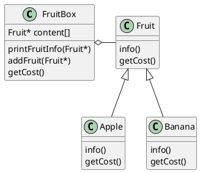

# Пример использования PlantUML

```plantuml:md-sample-sequence
@startuml
class FruitBox {
    Fruit* content[]
    printFruitInfo(Fruit*)
    addFruit(Fruit*)
    getCost()
}
class Fruit {
    info()
    getCost()
}
class Apple {
    info()
    getCost()
}
class Banana {
    info()
    getCost()
}

Fruit <|-- Apple
Fruit <|-- Banana
FruitBox o- Fruit
@enduml
```

